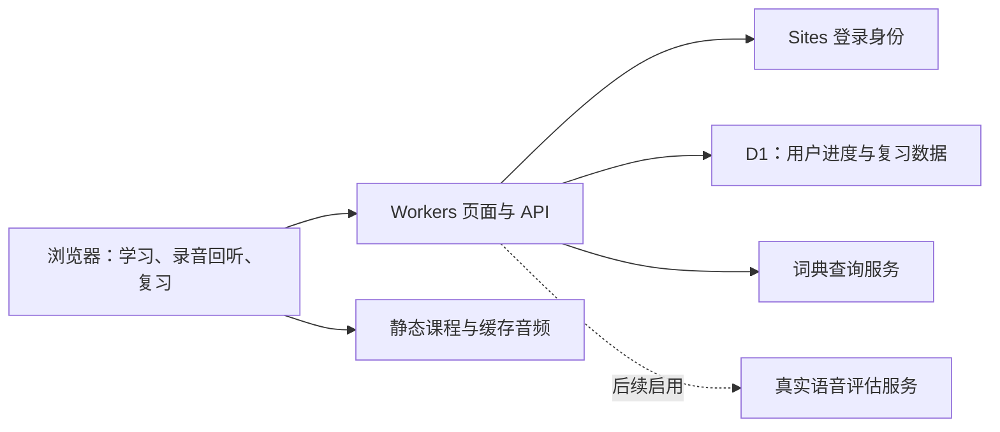

# 音记 / Yinji — 工程与教学方案

项目名：`PhoneticSymbolsLearner`。学习界面名：**音记**。目标学习者是中文母语的英文初学者，默认使用中文说明，可随时在右上角切换为基础英语。目标口音是通用美式英语；先建立听音和发音能力，再把声音、单词、语法、自然句子与复习连接起来。

本文记录产品设计和工程约束；**设计要求不等于已经通过验收**。实际发布记录、测试结果和未满足项见 [ACCEPTANCE.md](./ACCEPTANCE.md)。按用户后续确认，**本轮暂不做录音考核**：保留录音回听与示范对比，不上传录音、不生成发音评分。真实自动评估单列为后续扩展，不作为本轮完成条件。

## 1. 学习结果与诚实边界

| 用户目标 | 产品如何支持 | 不作出的承诺 |
| --- | --- | --- |
| 认识元音、辅音，读懂音标 | 声音图鉴、口型/舌位提示、清浊对比、最小对立组、听辨与跟读 | 不把字母数等同于音素数，不宣称一个音标表覆盖所有英语口音 |
| 看到陌生词能读 | 拼读模式、重音、音节和常见例外；用词典 IPA 与词条录音确认 | 英语拼写不能唯一确定所有词的读音；人名、地名和多音词需要查证 |
| 大致理解陌生词 | 常见词根、前后缀、语境和词典释义 | 词根只能给线索，不能保证任意单词的意思；词源拆分也可能误导 |
| 认识名词、动词、形容词及时间表达 | 先学词在句子里的工作，再学动词结构和时间线 | 同一个词可有多种词性；时态/体属于句中动词结构，不能只凭孤立单词判定 |
| 用对 a/an 和复数 | 从紧随其后的声音判断冠词，分别学习复数拼写与词尾读音 | 不把 a/an 当作形容词；不把所有词都套进加 s 规则 |
| 听懂和说出连贯句子 | 意群、重读弱读、辅音接元音、重复辅音、自然语速对比 | 连读不是每两个词都强制合并；清晰表达优先于模仿特定说话习惯 |
| 持续复习 | 错题、我的单词、复习日程、可打印复习册和数据导出 | 课程通过不等于现实会话或发音已获专业认证 |

美式音标采用课程定义的一套一致记号：使用 /ɛ i u ɑ ɔ/ 而不标长度号；宽式 /r/ 对应常见实际发音 [ɹ]；/ɝ/ 用于重读、/ɚ/ 用于非重读。/ɑ/ 与 /ɔ/ 在部分美式口音中的合并也被接受。词典常见的 /i/ 与 /iː/、/u/ 与 /uː/ 等不同写法要解释对应关系；不要因此把同一目标音误计为两个新音。变体、卷舌元音、/t/ 的闪音等须标注层级：基础音素与实际语流变化分开教。

声音图鉴提供 **41 张学习卡**：24 张辅音卡、10 张非卷舌单元音卡（含弱读 /ə/）、5 张双元音卡和2张卷舌元音卡。卡片是教学分类，不宣称通用美式英语只有一种“41 音位”的分析。

## 2. 课程结构：7 阶段、42 课

每阶段 6 课，共 42 课、126 个概念块、252 道题。前一阶段建立下一阶段需要的能力，后续题目持续复现旧知识；不采用每页一个定义后立即跳走的组织方式。具体课名、题目与解释以版本化课程数据为准；这些数量描述内容规模，不代表教学效果已经验证。

| 阶段 | 主线 | 过关时应能完成 |
| --- | --- | --- |
| 1. 听见声音的地图 / Meet the sounds | 字母与声音、元辅音、元音家族、基础听辨 | 分清声音与字母，听出入门最小对立组 |
| 2. 给声音加上轮廓 / Build consonants | 清浊、发音部位、辅音家族和组合 | 对照口腔动作听辨并练习辅音 |
| 3. 从拼写读到单词 / Read new words | 拼读模式、音节、重音、规律和例外 | 按音标读词，并知道何时需要查词确认 |
| 4. 让单词表达意思 / Words and meaning | 词义、词根词缀、名词/动词/形容词、句中作用 | 用简单句说明词义和词性，区分猜测与词典证据 |
| 5. 把动作放进时间 / Actions and time | 一般现在、一般过去、现在进行、过去完成及对比 | 在短句中识别并构造对应的动词结构 |
| 6. 冠词、数量与词尾 / Articles and endings | 可数与不可数、a/an、规则与不规则复数、-s 的读法 | 解释 an hour / a university 等例子，并正确读出复数词尾 |
| 7. 连贯表达与复习 / Speak and review | 意群、重弱读、连接、语流变化、综合练习 | 模仿自然短句，独立查词与回练，建立个人复习册 |

每课采用同一条完整学习链：目标与前置回顾 → 两至三个渐进讲解块 → 正反例/听示范 → 有反馈的练习 → 独立小测 → 记录薄弱点并安排复习。每段解释回答“是什么、怎么做、为什么、常见误区”；英文版用短句和基础词汇，并允许打开中文辅助说明。

题型覆盖听音选词/音标、最小对立组、音素归类、词义与词性判断、填空、单词/句子排序、时态结构识别、冠词和复数应用、连读位置识别、跟读录音。每题拥有稳定 ID、考点、答案、中文/英文解释与相关课程；乱序选项只改变展示顺序，不改变答案含义。

练习答错时立即显示正确答案与原因，可以重复听音并展开完整知识点。阶段考核按正确题数/有效题数计算，达到 **80%** 才视为通过；未通过可按错误考点回练后重考。只有客观题计入当前自动通过率，录音练习明确作为自评活动，避免把“有声音”计作“发音正确”。

## 3. 页面与设备适配

主导航是学习之路、声音图鉴、我的单词、复习册。学习过程使用一个核心卡片承载一个动作，保留播放、重听、帮助与提交按钮。桌面和平板可显示学习路线及进度栏；窄屏收起辅助栏，优先显示当前题与操作。

“一个屏幕学习”定义为常规题目的提示、答题区、核心操作在当前可用视口内可达，没有横向滚动或被固定工具栏遮住；**长讲解、词典结果和复习册允许在明确的内容区域纵向滚动**，不通过缩小文字把所有内容硬塞进一屏。视口由浏览器实际报告值决定，不能以设备物理像素直接写死 CSS。

- 使用响应式 Grid/Flex、`min-width: 0`、动态视口单位和安全区间距；手机优先，屏幕展开/旋转后重排，保留当前题和输入。
- 使用足够大的触摸控件、可见焦点、可读字号、文字加图标状态、标签化音频和录音按钮；不依赖悬停、颜色或拖拽作为唯一操作方式。
- 右上角语言切换影响导航、题干、解释、反馈、权限说明与错误消息，保留当前答题状态；所学英文单词和 IPA 本身不翻译。
- 音频须由明确的播放动作触发，录音状态与正在播放状态明显可辨；减少动画偏好生效。
- 模拟覆盖手机窄屏、平板横竖屏、折叠屏接近正方形的内屏；目标机型为 iPhone 16 Pro、iPad、vivo X Fold5 内屏。CSS 视口模拟只证明布局，不证明真实 Safari/Chrome、扬声器、麦克风或折叠事件兼容。

## 4. 技术架构

采用 React + TypeScript，Vinext 运行于 Sites 提供的 Cloudflare Workers 托管环境。静态课程数据与已生成的音频一起发布；D1 保存账号对应的学习记录。ChatGPT 登录由 Sites 处理，公开访客可先试学。

模块分工：课程数据负责知识点与题目；客户端负责交互和本地缓存；服务器负责身份、输入校验、数据隔离与持久化；语音播放与录音控制独立封装；词典和未来评估提供方通过服务端适配层接入。客户端不得持有提供方密钥。

数据契约如下，最终字段以实现为准：

| 实体 | 关键字段与约束 |
| --- | --- |
| 课程内容 | `contentVersion, stageId, lessonId, skillIds, questions, explanations`；版本化，ID 不随标题改变 |
| 用户与继续学习 | 服务端可信 `userId`；`profiles` 保存 `resume`：课程、阶段、题目下标、答案与 `runId` |
| 练习事件 | `attempts` 按唯一 UUID 幂等追加；`runId:questionId` 标识同轮每题，服务器验证答案 |
| 课程成绩 | `runs` 由服务器计算得分和 80% 门槛；不信任浏览器提供的通过标记 |
| 错题 | 从答题日志推导错误次数、最近答案、连续答对次数及下次复习日 |
| 个人单词 | 规范化词条、用户备注、IPA/词性/释义、来源、收藏时间、复习状态 |
| 复习状态 | 上次复习、下次到期、连续答对次数/间隔、最后答题结果 |
| 音频目录 | 内容 ID、原文或音素输入、音色、模型/版本、文件路径、内容哈希 |

## 5. 登录、同步和并发

访客仅在当前会话试学，退出或刷新可能丢失；界面直说“试学不保存，登录后同步”，不显示“已云同步”。同一账号登录后从服务器恢复进度，使用 Sites 注入的稳定用户 ID 做数据主键。邮箱只作可选显示信息，不用来识别同一个人；生产环境不信任客户端提交的 `userId` 或任意伪造身份头。

跨设备最低要求是设备 A 保存后设备 B 重新加载能读到相同课、错题、收藏和复习状态。同步状态至少区分保存中、已同步、离线待同步、保存失败，失败必须保留本地修改并允许重试。

并发练习使用不可变事件合并，UUID 幂等重试不会重复记分，不采用整库快照覆盖。服务器基于完成记录恢复课程状态并计算最佳成绩。收藏词按规范化词条去重，同词条采用最新写入；当前继续学习位置也是最近保存值。因此同时在两台设备编辑同一词的备注或推进不同课程时，最后保存的备注/继续位置会覆盖此前值，但不同练习事件应全部保留。删除采用显式服务器操作，避免旧客户端重复插入造成误恢复。

账号切换清除账号专属的内存状态，再装载新账号数据。共享设备退出后不应继续显示前一账号的私有复习册。导出包带格式版本，不含身份凭证。首版不把访客会话误称为可同步的离线账号；以后若增加访客迁移或备份导入，要采用明确、幂等的路径，并验证结构、长度和版本。

## 6. 语音：示范先可靠，评估必须有证据

### 示范音频

课程示范采用本地 Kokoro 生成并缓存的美式男声 `am_puck`；这是 AI 合成示范，不是真人录音。原始模型的官方声音表将此音色列在美式英语男声中，但“年轻感、自然度、教学清晰度”必须通过试听验收，不能只靠音色名称保证。[Kokoro 官方声音表](https://huggingface.co/hexgrad/Kokoro-82M/blob/main/VOICES.md)

素材生成脚本扫描课程内的英文 `audioText`、`target` 和 `word`，以归一化文本索引，输出 24 kHz 单声道 MP3 和 `public/audio/manifest.json`，记录路径、原文、时长、音素和课程来源；固定音色 `am_puck`、生成速率 0.90，支持断点续生。具体可复现步骤见 [SPEECH-RESEARCH.md](./SPEECH-RESEARCH.md)。

声音卡分开提供目标音与例词示范。`scripts/generate-phonemes.py` 通过模型原始音素接口按 0.75 速率生成 41 个目标音；`manifest.phonemes[sound.id]` 保存路径、符号、模型输入、时长、类型、速率与 `reviewedByHuman` 标记。爆破音不附加 /ə/；不把 IPA 交给普通文本 TTS 当字母名字读。生成和解码成功后仍需逐个试听审校，不能把技术生成成功标成专业发音认证。按钮区分“音素 / sound”与“例词 / example”。为听辨题生成一致音量的对照素材，为句子保持完整韵律，不能拼接单词录音冒充自然连读。

发布前扫描素材缺失、损坏、空白、截断和异常时长，抽听所有音素及高风险对立组。慢速播放需尽量保持音高。系统 TTS 只可作为明确标注的后备，不能计作已完成用户要求的固定男声素材。未缓存的自定义单词、任意词典词条和任意新句子需说明其播放来源，不能宣称全部使用同一音色。

### 当前录音能力

点击录音后再申请麦克风权限；用户可停止、回听、重录。音量和时长仅用于“是否录到声音、是否太短、是否过响”等录音质量提示，结合目标句和口型提示帮助自练。它们不能识别音素、断定单词发音错误、证明听懂意思，也不能产生专业发音分数。

用户已明确同意本轮忽略录音考核，因此当前不接入录音上传/评估接口，也不把云端额度作为本轮阻塞项。录音功能的范围就是本地回听、自评和与 AI 示范对比；不得返回示例分析伪装成用户录音结果。

### 后续真实评估的启用条件

1. 有可用且允许此用途的音频评估服务、预算、速率限制与服务器密钥；确认地区、数据保留和删除策略。
2. 在录音上传前明确告知发送给谁、发送什么、用途、保留时长，并让用户主动点击分析；纯回听不上传。
3. 针对固定目标文本，服务返回真实转写、音素或单词级对齐、置信度、重音/节奏证据；如果提供方只有语音转写，不宣称可诊断全部发音问题。
4. 使用包含中国初学者常见错误、背景噪声和多种正常美式变体的验证集，与人工反馈比较；低置信度时拒绝武断评分并建议重录。
5. 解释只指出有证据的片段，提供目标音、可练动作和对照示范；强调可理解性，避免把正常口音差异判错。
6. “理解程度”另用听辨、词义和问答题评估；发音像示范不代表理解意思。

## 7. 查词、词根和时态

内置词库提供中文义项；外部词典通过服务端代理访问 [Free Dictionary API](https://dictionaryapi.dev/)，补充英文释义，用户可添加中文笔记。外部查询是增强功能：须规范化输入、限制长度、超时、校验返回结构，并按来源条款处理缓存与署名；失败时保留用户输入和本地词条，清楚显示暂时不能查询。

词条展示美式 IPA（如源数据有）、多个词性、基础释义及例句。缺少美式读音时不要把来源不明的 IPA 标成美式；同形异音词要按词性和语境区分。外部释义与录音保留来源，不直接把受版权保护的词典库打包进项目。

词根提示标为“词义线索 / word clue”，查证后才显示词典释义。时态问题使用完整句子和动词结构：`walk / walks`、`walked`、`am/is/are walking`、`had walked`；明确名词没有“过去完成时”。多词性词例如 `work` 通过 `I work` 和 `my work` 展示，不能永久给一个单词贴唯一词性。

## 8. 复习册与间隔复习

答错题与手动收藏词进入同一套个人复习数据，但分别显示来源与考点。复习册至少包含日期、题目、我的答案、正确答案、解释、相关词与下次复习；再次答错保留历史/计数，不能通过刷新页面消除。

首版从答题日志计算复习状态：答错安排当前日回练，连续答对后的间隔按 1、3、7、14、30 天递增；再次答错退回短间隔。不宣称使用经过个体校准的记忆预测算法。到期排序先处理到期题和新错题；用户可主动提前练习。

复习数据提供 JSON、Markdown 导出和打印版。打印版移除导航和操作栏，保留 IPA 字形、答案/解释与必要分页，可通过浏览器打印为 PDF；不能把导出 JSON 称为排版完成的电子册。内容过长应正确分页，不能截掉错题。删除收藏与清空个人记录需要明确操作和可见结果。

## 9. 隐私与服务端保护

录音默认仅保存在当前页面的内存和本地对象 URL，回听不上传；停止或离开录音功能时停止所有麦克风轨道，撤销不再使用的对象 URL。麦克风权限仅在 HTTPS 或浏览器允许的安全上下文使用，并处理拒绝、无设备、设备占用和不支持录音等情况。[MDN getUserMedia](https://developer.mozilla.org/en-US/docs/Web/API/MediaDevices/getUserMedia)

服务器写入必须验证登录态、来源和数据 schema，限制请求大小、字段长度、允许值及调用频率。所有 D1 查询参数化，以当前服务端身份限定读写；匿名请求不能写入其他用户数据。用户输入、词典内容和未来模型输出均当作不可信文本呈现，不直接插入 HTML。

课程资产可公开缓存；个人进度响应不可进入共享公共缓存。日志只记录诊断所需的状态/计时，不记录原始录音、身份凭证、用户完整学习文本或外部密钥。公开 GitHub 不提交 `.env`、运行缓存、数据库、录音、账号信息或模型访问令牌。依赖和语音模型的独立许可与来源需保留。

## 10. 交付和下一步

交付包括可运行源码、42 课课程数据、示范素材与清单、个人学习记录、复习册、工程说明、验收记录及许可。以此文件夹名建立个人公开 GitHub 仓库 `PhoneticSymbolsLearner`，通过 Sites 发布公开 HTTPS 地址；公开课程可访问，个人数据需要登录。

发布流程：内容与资源检查 → TypeScript/构建/必要自动测试 → 手机/平板/折叠内屏 CSS 视口操作验证 → 身份隔离与进度恢复验证 → 公开部署 → 在发布 URL 再次验证关键流程。记录部署地址、Git 提交和实际测试环境；本地构建通过不能代替部署成功。

第一版之后优先补充人工语音审校与真实设备回归，再扩展词库、题目变体和个性化复习；真实语音评估作为用户同意暂缓的独立迭代。不得把这些事项在没有证据时标记完成。

本项目使用自定义非商业源码许可，允许个人/非商业教育研究和修改分发，禁止商业用途。第三方素材仍按各自许可处理。非商业限制不符合 OSI 开源定义中的用途不受限要求，因此称为“公开源码 / source available”，不称为 OSI 开源。[项目许可](../LICENSE) · [OSI 定义](https://opensource.org/osd)

## 11. 依据

- [Cambridge：a/an 与 the](https://dictionary.cambridge.org/grammar/british-grammar/a-an-and-the)：冠词教学以紧随其后的声音为依据。
- [Kokoro 官方模型卡](https://huggingface.co/hexgrad/Kokoro-82M/blob/main/README.md)：模型与许可来源；生成资产与模型依赖分别记录。
- [Kokoro 官方声音表](https://huggingface.co/hexgrad/Kokoro-82M/blob/main/VOICES.md)：`am_puck` 类型与短片段质量限制。
- [MDN：getUserMedia](https://developer.mozilla.org/en-US/docs/Web/API/MediaDevices/getUserMedia)：安全上下文和麦克风权限行为。
- [Free Dictionary API](https://dictionaryapi.dev/)：词典请求与响应字段；具体词条仍保留自身来源和许可信息。
- [OSI：Open Source Definition](https://opensource.org/osd)：公开源码与非商业许可的命名边界。

文档日期：2026-10-04（Asia/Shanghai）。
